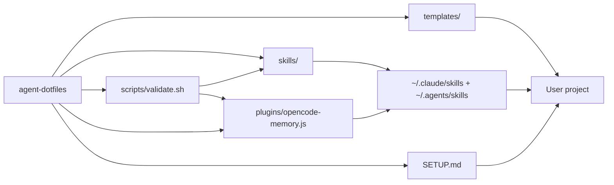

# Flows

> Data flows in chain notation: `NODE(A) -> NODE(B)`. Externals: `EXTERNAL API` / `EXTERNAL:<name>`.

## Main flows

```
NODE(A2) -> NODE(B) -> NODE(C)          # skills -> global installation -> projects
NODE(A4) -> NODE(B) -> NODE(C)          # opencode plugin -> global plugin dir -> projects
NODE(A1) -> NODE(C)                     # templates -> projects
NODE(A5) -> NODE(C)                     # one-shot setup (SETUP.md + ONBOARDING.md) -> projects
NODE(A3) -> NODE(A2), NODE(A4)          # validate.sh validates the skills and the plugin
```

## Memory enforcement (opencode)

```
session.idle -> memory.md exists? -> git status --porcelain -- memory.md -> non-empty? no-op
             -> empty -> client.session.prompt(active-brain-memory) -> model saves -> next idle no-op
```

The opencode plugin (`NODE(A4)`) listens for `session.idle`. If the project has a
`memory.md` and it was not touched this turn, it injects a prompt asking the model
to run the active-brain-memory skill and update `memory.md`. Natural termination:
once saved, `git status` shows the change and the next idle is a no-op.

## Brain loop (in the repo and in client projects)

```
AGENTS.md -> memory.md <-> architecture.md
```

AGENTS.md (always loaded) forces reading memory.md at the start of every session; the active-brain-memory and architecture skills keep the files continuously updated.

## Mermaid (for humans)


