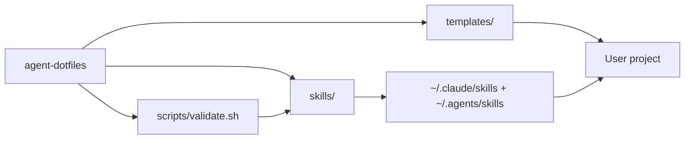

# Flows

> Data flows in chain notation: `NODE(A) -> NODE(B)`. Externals: `EXTERNAL API` / `EXTERNAL:<name>`.

## Main flows

```
NODE(A2) -> NODE(B) -> NODE(C)          # skills -> global installation -> projects
NODE(A1) -> NODE(C)                     # templates -> projects
NODE(A3) -> NODE(A2)                    # validate.sh validates the skills
```

## Brain loop (in the repo and in client projects)

```
AGENTS.md -> memory.md <-> architecture.md
```

AGENTS.md (always loaded) forces reading memory.md at the start of every session; the active-brain-memory and architecture skills keep the files continuously updated.

## Mermaid (for humans)


