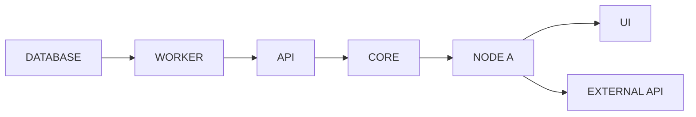

# Flows

> Data flows in chain notation: `NODE(A) -> NODE(B) -> ...`.
> External systems: `EXTERNAL API` or `EXTERNAL:<name>`.

## Main flows
```
DATABASE -> WORKER -> API -> CORE -> NODE(A) -> UI
NODE(A) -> EXTERNAL API
```

## Mermaid (for humans — generated from the text above)

